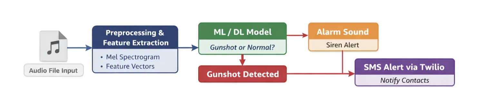
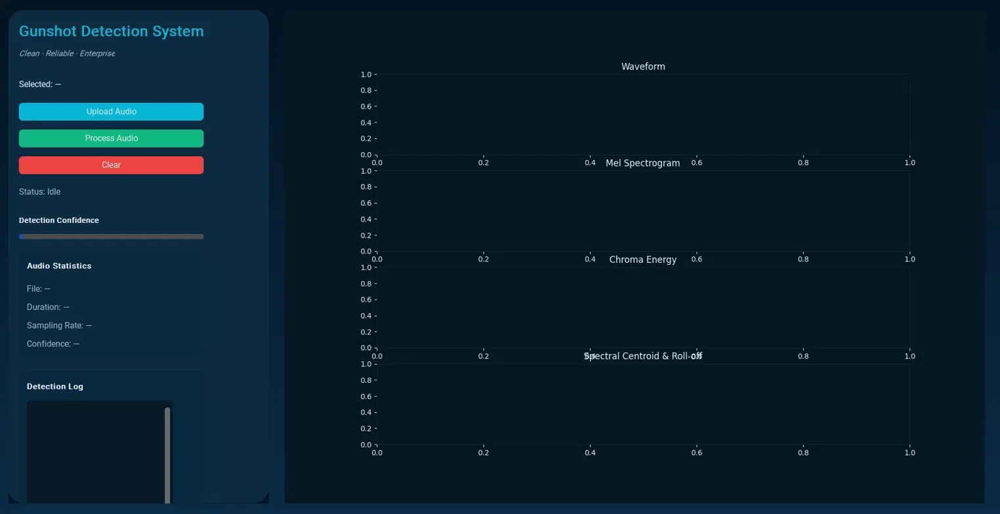
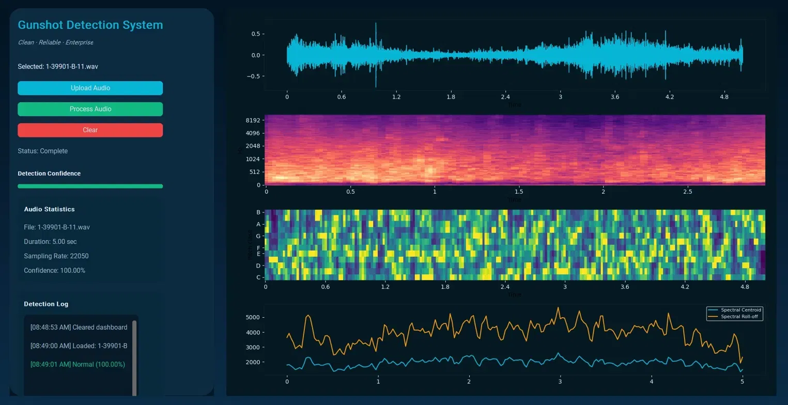
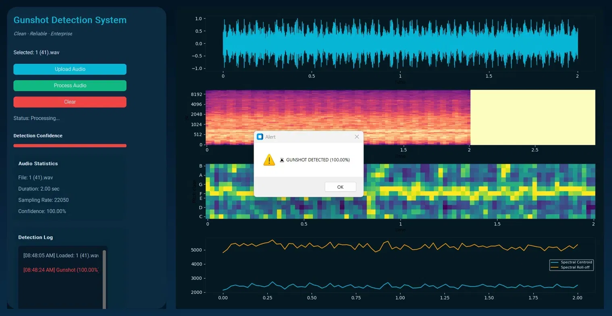

# 🔫 Gunshot Detection Dashboard

**Real-time, deep learning–powered gunshot detection system** — analyzes live audio or uploaded recordings, classifies gunshot vs. normal sound, and triggers instant alerts (on-screen, siren, and SMS).

> Clean · Reliable · Enterprise

---

## 📌 Overview

This project is a desktop application that listens to audio (live or uploaded), runs it through a trained deep learning classifier, and visualizes the signal in real time across four analysis views — waveform, mel spectrogram, chroma energy, and spectral centroid/roll-off. When a gunshot is detected with high confidence, the system fires an on-screen alert, plays a siren, and sends an SMS notification via Twilio.

---

## 🧠 How It Works



```
Audio File Input → Preprocessing & Feature Extraction (Mel Spectrogram, Feature Vectors)
                 → ML/DL Model (Gunshot or Normal?)
                       ├── Gunshot Detected → Alarm Sound (Siren)
                       └──                  → SMS Alert via Twilio (Notify Contacts)
```

---

## ✨ Features

- 🎙️ Live audio or uploaded recording input
- 📊 Real-time waveform, mel spectrogram, chroma energy, and spectral centroid/roll-off visualization
- 🎯 Detection confidence score with live progress bar
- 🚨 Instant on-screen alert, siren activation, and Twilio SMS notification on verified detection
- 📝 Running detection log with timestamps

---

## 🛠️ Tech Stack

| Component | Tool/Library |
|---|---|
| Language | Python |
| Deep Learning | Custom-trained audio classification model (`.h5`) |
| Audio Processing | Mel spectrogram, chroma, spectral feature extraction |
| Alerts | Twilio SMS API, local siren playback |
| Interface | Desktop GUI (CustomTkinter) |

---

## 🖼️ Screenshots

| Idle State | Normal Detection | Gunshot Alert |
|---|---|---|
|  |  |  |
| Dashboard before any audio is loaded | Audio processed and classified as normal (100% confidence) | Live alert firing on a verified gunshot detection |

---

## 📂 Repo Structure

```
gunshot-detection-dashboard/
├── README.md
├── Training_code.py          # Model training pipeline
├── Testing_code.py           # Inference/testing script
├── Testing_code_mod_ctk.py   # Dashboard GUI (CustomTkinter)
├── skp.py
├── test_env.py
├── alert.mp3 / alert.wav     # Siren alert sound
├── datasets and ml (.h5)file.md
└── screenshots/
    ├── pipeline-diagram.png
    ├── dashboard-idle.png
    ├── dashboard-normal.png
    └── dashboard-alert.png
```

---

## ⚠️ Security Note

This repo previously had a `.env` file committed with live credentials. If you're cloning or forking, **do not reuse those keys** — rotate any Twilio credentials before deploying your own instance, and keep `.env` out of version control going forward (add it to `.gitignore`).

---

## 👤 Author

**Swasthik K P**
📧 kpswasthik2004@gmail.com · [LinkedIn](https://linkedin.com/in/swasthik-k-p-7b927b377) · [GitHub](https://github.com/Swasthikkp)
